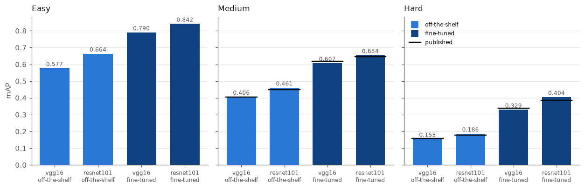
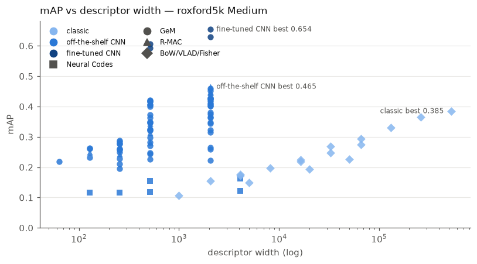

# image-retrieval
Modern image retrieval inspired by 10-year old bachelor's diploma nostalgia

## Setup

```
uv sync
```

## Downloading the benchmark data

```
uv run cbir download --datasets roxford5k rparis6k
# or: uv run cbir download --datasets all
```

Downloads the [ROxford5k and RParis6k](https://huggingface.co/datasets/galilai-group/revisitop)
image retrieval benchmarks into the default Hugging Face cache (`~/.cache/huggingface`),
shared across projects rather than duplicated locally. Each dataset is sanity-checked
against its known image/query counts before use.

Only these two configs are supported — the `revisitop1m` and `oxfordparis` configs in
the upstream loading script are broken and are rejected outright. See
[AGENTS.md](AGENTS.md) for details.

## Evaluating

```
uv run cbir evaluate --dataset roxford5k bow --k 20000
uv run cbir evaluate --dataset roxford5k vlad --k 256
uv run cbir evaluate --dataset roxford5k fisher --k 64

# a sweep is one run per k, sharing a single descriptor extraction
uv run cbir evaluate --dataset roxford5k --sweep 16 64 256 vlad --seed 0
```

### Presets

The interesting configurations carry up to ten flags, and the fine-tuned ones only work
in one combination. Every row this README quotes is available by name:

```
uv run cbir evaluate gem-ft-r101
uv run cbir evaluate gem-ft-r101 --scales 1.0   # a preset is a starting point
uv run cbir evaluate --help                     # lists techniques and presets together
```

A preset is a subcommand like any technique, not a `--preset` flag: a technique's knobs
are defined *inside* its subcommand, so a flag would have nowhere to put `--scales` and
would leave you with a configuration you cannot adjust.

They live in `configs/presets.py` as config *instances*, not YAML — so each one is
type-checked at import, validates on construction, and an override re-validates:
`--p 3.0` on a fine-tuned preset is rejected rather than quietly evaluating the network
at a pooling it was never trained for. `tests/configs/test_presets.py` holds every preset
to a row already in `results/runs.jsonl`, so a preset cannot drift from the configuration
that was actually measured.

Each run extracts RootSIFT, trains the codebook **on the other dataset**, encodes the
database and the bbx-cropped queries, searches exactly, scores all three protocols, and
appends a row to `results/runs.jsonl`. Read rows back with `cbir results`
(`--current-only` collapses re-runs). RootSIFT extraction and codebooks are cached under
`data/`, so re-running a `k` costs only the encode.

`k` means something different per technique — it is the descriptor dimensionality for
BoW, `k*128` for VLAD and `2*k*128` for Fisher — so compare on dimensionality, not `k`.

## Classic-tier results


Plotted against **descriptor dimensionality**, not `k` — the axis on which the three are
comparable, since equal `k` buys wildly unequal vectors. Regenerated by the last cell of
`notebooks/02_classic_comparison.ipynb`, so it cannot drift from the numbers below.

roxford5k, codebook held out on rparis6k, seed 0, mAP on 0–1. Medium is the headline
number in the literature; Easy is near-saturated and reported in `results/runs.jsonl`
only.

| method | k | dim | Medium | Hard |
|---|---:|---:|---:|---:|
| BoW | 1000 | 1000 | 0.107 | 0.028 |
| BoW | 5000 | 5000 | 0.148 | 0.057 |
| BoW | 20000 | 20000 | 0.194 | 0.076 |
| BoW | 50000 | 50000 | 0.226 | 0.087 |
| Fisher | 16 | 4096 | 0.176 | 0.063 |
| Fisher | 64 | 16384 | 0.219 | 0.106 |
| Fisher | 128 | 32768 | 0.247 | 0.118 |
| Fisher | 256 | 65536 | 0.274 | 0.144 |
| VLAD | 16 | 2048 | 0.154 | 0.042 |
| VLAD | 32 | 4096 | 0.173 | 0.056 |
| VLAD | 64 | 8192 | 0.197 | 0.080 |
| VLAD | 128 | 16384 | 0.224 | 0.100 |
| VLAD | 256 | 32768 | 0.269 | 0.134 |
| VLAD | 512 | 65536 | 0.295 | 0.137 |
| VLAD | 1024 | 131072 | 0.331 | 0.162 |
| VLAD | 2048 | 262144 | 0.365 | 0.190 |
| **VLAD** | **4096** | **524288** | **0.385** | **0.195** |

**Validation.** Radenović et al. report `HesAff–rSIFT–VLAD` at Medium 0.339 / Hard 0.132 on
this benchmark ([1803.11285](https://arxiv.org/abs/1803.11285), Table 5). VLAD k=1024
here reaches 0.331 / 0.162 — with OpenCV DoG SIFT rather than Hessian-Affine, no
PCA-whitening, and a vocabulary trained on rparis6k rather than a separate landmark set.
Landing on a published number is what licenses trusting the rest of the table; the larger
`k` above it then exceed that reference.

At matched dimensionality the ordering is **VLAD ≥ Fisher > BoW** at every point. Fisher
looks stronger at equal `k` only because its vector is twice as long there.

**VLAD may be levelling off near k=4096, but this is not established.** Its Medium
increments per doubling run +0.019, +0.025, +0.026, +0.046, +0.025, +0.037, +0.034,
+0.019 and Hard's run +0.014, +0.024, +0.020, +0.034, +0.003, +0.025, +0.027, +0.005. The final doubling is the smallest for
both — but Hard already dropped to +0.003 at k=512 and then resumed at +0.025 and
+0.027, so a
single small increment has misled here before. Treat k=4096 as the point where returns
stop justifying the cost (twice the storage, 5.2 → 10.5 GB for the database matrix, for
under 0.02 mAP) rather than as a demonstrated ceiling. Confirming a real plateau needs
k=8192, which this setup cannot reach.

BoW and Fisher were not pushed anywhere near their knees; both were still climbing where
they stop above, so their last rows are budget limits, not ceilings.

k=8192 is out of reach here, and RAM is not the reason: `exact_search` moves the database
matrix to the GPU, and 21 GB does not fit in 15.9 GB of VRAM. Going further needs a
chunked search, not a bigger machine.

Caveats: single seed, so small gaps are unresolved; roxford5k only, so the ranking is not
cross-checked on rparis6k; Fisher's GMM is fitted on a seeded 1M-descriptor subsample.

`notebooks/02_classic_comparison.ipynb` (classic tier) and `03_cnn_comparison.ipynb`
(CNN tiers) plot all of this from `results/runs.jsonl`; both share palettes and styling
via `notebooks/style.py`. Run it
top to bottom — it ships with outputs stripped.

For a browsable dashboard instead, install the optional extra and mirror the record:

```
uv sync --extra tracking
uv run cbir track --current-only     # replay results/runs.jsonl into trackio
trackio show --project cbir
```

trackio is entirely optional — no account, no network, one local SQLite file — and the
store is *derived* from `results/runs.jsonl`, never the reverse. Delete
`~/.cache/huggingface/trackio/cbir.db` and re-run `cbir track` to rebuild it from
scratch at any time.

### Reproducing the table

```
uv run cbir evaluate --dataset roxford5k --sweep 1000 5000 20000 50000 bow --seed 0
uv run cbir evaluate --dataset roxford5k --sweep 16 32 64 128 256 512 1024 2048 4096 vlad --seed 0
uv run cbir evaluate --dataset roxford5k --sweep 16 64 128 256 fisher --seed 0
```

Roughly 10 hours cold on 16 cores, most of it BoW's k-means at k=20000 and k=50000. VLAD
is 12–31 min per point — below k≈1024 its cost is loading descriptors rather than
clustering, so small `k` is nearly free once the sweep is running.

VLAD at k=4096 needs more than 48 GB of RAM: `encode` holds about three copies of the
10.5 GB database matrix while the ~20 GB of RootSIFT descriptors are still resident. It
was run with WSL at 64 GB. Below k=2048 the default 48 GB is fine.


## CNN-tier results

Frozen ImageNet backbones, plus the published fine-tuned checkpoints in their own
section below. Same protocol as the classic tier:
roxford5k, anything fitted is fitted on rparis6k, seed 0, mAP on 0–1, queries
bbx-cropped, multi-scale at the three published scales (1, 1/√2, 1/2). Published figures
are quoted on the same 0–1 scale; the papers themselves print them ×100.

```
uv run cbir evaluate --dataset roxford5k gem  --backbone resnet101 --p 3.0 \
    --scales 1.0 0.7071067811865476 0.5 --dim 2048 --whiten --weights caffe
uv run cbir evaluate --dataset roxford5k rmac --backbone resnet101 --levels 3 \
    --scales 1.0 0.7071067811865476 0.5 --dim 2048 --whiten --weights caffe
```

### Weight provenance is not a detail

"ImageNet-pretrained ResNet101" is not one object. `cnnimageretrieval` builds a
torchvision architecture and fills it with **Caffe-converted** ImageNet weights; we
started with torchvision's. Same architecture, same dataset, same task, different
training recipe — and the descriptors agree at cosine 0.23.

| GeM `p=3` | torchvision | caffe | Δ |
|---|---:|---:|---:|
| **ResNet101** | 0.347 | **0.461** | **+0.114** |
| ResNet50 | 0.408 | 0.425 | +0.017 |
| VGG16 | 0.420 | 0.406 | −0.014 |

It is architecture-specific, not a blanket improvement: torchvision's ResNet101 simply
transfers to retrieval far worse than its ResNet50, and on VGG16 the Caffe weights are
slightly *worse*. MAC is affected most (+0.162 on ResNet101, +0.080 on ResNet50), which
fits the measured difference in the features — Caffe's final conv map is **96% zeros at
std 0.72** against torchvision's **75% at 0.33**, a sparser, higher-contrast
representation where a max picks a real peak rather than diffuse activation.

The 53× difference in conv1 weight scale is *not* the cause: BatchNorm follows conv1 and
its `running_var` ratio (3392) matches that scale squared (2819), so it divides straight
back out. Nor is it channel order — per-filter matching is worse under BGR than RGB. The
two networks simply learned different features.

This cost six wrong hypotheses. Every one assumed the backbone was a fixed input and
looked for the bug downstream; the published table disagreeing with our measurement was
pointing at the input the whole time.

### Validation against the reference table

Radenović et al. ([1803.11285](https://arxiv.org/abs/1803.11285), Table 5), matching
their configuration — their weights, their truncation:

| method | backbone | ours | published | |
|---|---|---:|---:|---|
| GeM `p=3` | VGG16 | 0.405 / 0.155 | 0.405 / 0.157 | exact |
| GeM `p=3` | ResNet101 | 0.461 / 0.186 | 0.450 / 0.177 | above |
| MAC | ResNet101 | 0.427 / 0.172 | 0.417 / 0.180 | above |
| MAC | AlexNet | 0.276 / 0.090 | 0.283 / 0.088 | −0.7 |
| R-MAC | ResNet101 | 0.465 / 0.142 | 0.498 / 0.185 | **−3.2** |

**VGG16 reproduces exactly** once the configuration matches. Our earlier 0.420 was not a
better reproduction — it was a *different* configuration (torchvision weights, trailing
max-pool kept) that happens to score 0.015 higher than the method it was compared
against.
Both differences pushed the same way.

**R-MAC is the one row still short, with an identified cause**: the published method
PCA-whitens each *region* vector before summing them, while ours whitens the finished
descriptor. Whitening after the sum cannot undo the correlation the sum compounded.
Closing it needs a projection fitted on region vectors — permitted by the cross-dataset
rule, but deliberately not built: the cause is identified and the row is annotated, which
is worth more than a closed gap whose closing taught nothing.

### VGG's trailing max-pool

The reference builds VGG as `features[:-1]`, dropping the final max-pool; we kept it.
That is 4× the positions on the conv map — 64×64 against 32×32 at `max_side=1024`.

| vgg16 GeM `p=3` | pool kept | pool dropped |
|---|---:|---:|
| torchvision weights | 0.420 / 0.156 | 0.416 / **0.167** |
| caffe weights | 0.406 / 0.154 | 0.405 / 0.155 |

Small on Medium, but dropping it is worth **+0.011 Hard** on torchvision weights — more
positions to pool over helps most where the object is small or partly occluded.

### The full grid

All backbones on **torchvision** weights, whitened at native width, so the columns are
comparable to each other. The two ResNet rows that Caffe weights change materially are
noted underneath.

| backbone | dim | SPoC | MAC | GeM `p=3` | R-MAC |
|---|---:|---|---|---|---|
| AlexNet¹ | 256 | 0.210 / 0.025 | 0.276 / 0.090 | 0.279 / 0.072 | 0.244 / 0.041 |
| VGG16 | 512 | 0.372 / 0.109 | 0.349 / 0.137 | **0.420** / 0.156 | 0.344 / 0.073 |
| VGG19 | 512 | 0.347 / 0.100 | 0.346 / 0.151 | 0.400 / **0.184** | 0.336 / 0.065 |
| ResNet18 | 512 | 0.323 / 0.063 | 0.226 / 0.070 | 0.282 / 0.081 | 0.313 / 0.051 |
| ResNet34 | 512 | 0.324 / 0.059 | 0.243 / 0.065 | 0.298 / 0.068 | 0.336 / 0.067 |
| ResNet50 | 2048 | 0.429 / 0.142 | 0.322 / 0.111 | 0.408 / 0.140 | 0.451 / 0.127 |
| ResNet101 | 2048 | 0.381 / 0.102 | 0.265 / 0.067 | 0.347 / 0.108 | 0.428 / 0.111 |
| **ResNet101 (caffe)** | 2048 | 0.419 / 0.136 | 0.427 / 0.172 | 0.461 / **0.186** | **0.465** / 0.142 |
| *(VLAD k=4096, classic)* | *524288* | | | *0.385 / 0.195* | |

¹ AlexNet unwhitened — whitening costs mAP at 256-D.

**Best: ResNet101 R-MAC 0.465 Medium** from 2048 dimensions, against the classic tier's
best of VLAD k=4096 at 0.385 from **524288**. Hard is now close too — 0.186 against
VLAD's 0.195, where it used to be a rout.

**Which pooling wins is backbone-dependent.** GeM leads on VGG; the sum-like poolings
lead on the torchvision ResNets. Note the earlier claim that "MAC is worst on every
ResNet" was an artifact of the wrong weights: on Caffe ResNet101 it is second-best and
has the tier's second-best Hard.

**Depth buys little at fixed width.** ResNet18 → ResNet34 gains ~0.017 averaged over
methods; VGG16 → VGG19 loses Medium and gains Hard. The 512 → 2048 width jump is worth
far more, and weight provenance more than either.

### Whitening

Fitted on the held-out benchmark unless a row says otherwise. Gains sort by how much a
method **sums** rather than **maxes** — summing piles up shared components and whitening
decorrelates them, while a max creates no such correlation.

| VGG16, multi-scale | plain | + whitening | gain |
|---|---:|---:|---:|
| SPoC | 0.271 | 0.372 | **+0.102** |
| R-MAC | 0.282 | 0.344 | +0.062 |
| GeM `p=3` | 0.364 | 0.420 | +0.056 |
| MAC | 0.320 | 0.349 | +0.029 |

It reverses on AlexNet, where whitening costs MAC 0.033 mAP (0.229 → 0.196 single-scale) —
at 256-D there is little redundancy to remove and a proportionally noisier tail. Worth
measuring per backbone rather than assuming.

**`--shrinkage ε`** floors whitening's divisor at `sqrt(λ + ε·mean(λ))`. Whitening
divides by `sqrt(λ)`, and when the fitting set is not much larger than the descriptor the
smallest eigenvalues are noise. At 2048 components fitted on 2100 images the pipeline
scores **0.067** unshrunk and **0.393** at ε=0.1. In the regime we actually run (6322
images) it is worth +0.004 to +0.010 on the 2048-D backbones and +0.001 on VGG16 at
512-D.

**`--whiten-source sfm30k|sfm120k`** fits whitening on the retrieval-SfM landmark corpus
the reference uses (a 37.7 GB manual download; see `descriptors/cnn/sfm.py`). Worth +0.023
Medium on *torchvision* ResNet101 — but once the weights are right it stops helping
(0.461 → 0.453), so that gain was whitening compensating for weak features. It saturates
by ~30k images: 30k and 120k differ by 0.002.

### Fine-tuned checkpoints

Everything above is a frozen ImageNet classifier: optimized to tell a golden retriever
from a poodle, and useful for retrieval only because the features happen to transfer.
Radenović et al. also publish the same architectures **fine-tuned for retrieval itself**,
on retrieval-SfM-120k with a contrastive loss over landmark pairs mined by
structure-from-motion. Oxford/Paris overlaps were removed from that corpus, so the
cross-dataset rule holds: nothing was fitted on what it searches.

| backbone | scales | Medium mAP | mP@10 | Hard mAP | mP@10 |
|---|---|---:|---:|---:|---:|
| VGG16 | single | 0.593 | 0.810 | 0.323 | 0.499 |
| VGG16 | multi | 0.607 | 0.823 | 0.329 | 0.510 |
| ResNet101 | single | 0.630 | 0.833 | 0.383 | 0.541 |
| **ResNet101** | **multi** | **0.654** | **0.860** | **0.404** | **0.564** |

Against Table 5, which reports both metrics on both protocols — eight comparisons, not
two, and the paper does not evaluate Easy at all:

| multi-scale | Medium mAP | mP@10 | Hard mAP | mP@10 |
|---|---:|---:|---:|---:|
| VGG16 ours | 0.607 | 0.823 | 0.329 | 0.510 |
| V–[37]–GeM published | 0.619 | 0.827 | 0.337 | 0.510 |
| | −0.012 | −0.004 | −0.008 | **0.000** |
| ResNet101 ours | 0.654 | 0.860 | 0.404 | 0.564 |
| R–[37]–GeM published | 0.647 | 0.847 | 0.385 | 0.530 |
| | **+0.007** | **+0.013** | **+0.019** | **+0.034** |



**This is what the exercise was for.** Every earlier validation point sat at the bottom
of the published range, 0.40–0.46, where a 0.02 discrepancy is hard to read. Reproducing
0.647 confirms the evaluation path at the top of the range as well, so the gaps in the
off-the-shelf grid above are descriptor gaps and not harness gaps.

ResNet101 lands above its published row and VGG16 below its own — opposite directions,
which is not the shape a pipeline error takes. VGG16's Hard mP@10 is exact and its
Medium mP@10 is −0.004, so the top of its ranking matches and the ~0.01 mAP shortfall is in
the tail. One candidate was tested and rejected: matching the reference's resize order
(normalize first, then bilinearly interpolate the tensor, rather than our single bicubic
PIL resize from the original) moved Medium +0.002 and Hard −0.002. The residual is left
unexplained rather than tuned away.

**The pooling was never the problem.** `p` is differentiable and was therefore trained,
not chosen — and it came out at **2.9208** (VGG16) and **2.9033** (ResNet101) against the
hand-picked 3.0 used everywhere above. Training moved it by 3%. The entire ~0.19 mAP gap
between the off-the-shelf and fine-tuned rows is in the conv weights.

A checkpoint carries three things, and loading only the first would silently produce a
plausible wrong number: the conv stack, the trained `p`, and a supervised whitening
fitted on matching pairs after training (`meta['Lw']`, in `ss` and `ms` variants for
single- and multi-scale runs). The last of these means these runs fit **nothing** at
extraction time — there is no held-out pass at all, which is why they are also the
fastest rows in the tier.

```
uv run cbir evaluate --dataset roxford5k gem --backbone resnet101 --weights sfm120k \
    --p learned --scales 1.0 0.7071067811865476 0.5 --whiten --whiten-source learned
```

Checkpoints are a manual download (`retrievalSfM120k-vgg16-gem-b4dcdc6.pth`,
`retrievalSfM120k-resnet101-gem-b80fb85.pth`) into `CBIR_WEIGHTS_ROOT`; see
`descriptors/cnn/finetuned.py`. Only GeM was published — there is no fine-tuned R-MAC
checkpoint, and asking for one is refused rather than silently downgraded.

### Where the tiers stand



Same benchmark, same protocol, best row from each:

| tier | descriptor | dim | Medium | Hard |
|---|---|---:|---:|---:|
| classic | VLAD k=4096 | 524288 | 0.385 | 0.195 |
| off-the-shelf CNN | ResNet101 R-MAC, caffe | 2048 | 0.465 | 0.142 |
| off-the-shelf CNN | ResNet101 GeM `p=3`, caffe | 2048 | 0.461 | 0.186 |
| fine-tuned CNN | ResNet101 GeM, multi-scale | 2048 | **0.654** | **0.404** |

The off-the-shelf tier needs two rows because no single one wins both protocols: R-MAC
takes Medium and GeM takes Hard, and R-MAC's Hard is its weakest result — the
per-region-whitening gap documented above. Either way that tier beats the classic one on
Medium from a vector 256× shorter, while **losing** to it on Hard (0.195 against 0.186).

The fine-tuned row wins both outright: +0.270 Medium and +0.210 Hard over VLAD, at 1/256
the width — because the network was trained for the question being asked instead of
borrowed from a classifier.

### Neural Codes

| backbone | dim | Medium | Hard |
|---|---:|---:|---:|
| AlexNet fc6 | 4096 | 0.122 | 0.028 |
| AlexNet fc6 + PCA | 256 | 0.117 | 0.025 |
| VGG16 fc6 | 4096 | 0.163 | 0.051 |
| VGG16 fc6 + PCA | 512 | 0.154 | 0.050 |

Losing to everything else is expected. Babenko et al.
([1404.1777](https://arxiv.org/abs/1404.1777)) report the same ordering for codes off an
ILSVRC-trained network — their contribution is that *retraining* on a landmark set fixes
it, and this harness runs frozen networks only. There is no ROxford reference for the
method, so these rows compare only against our own.

### Other findings

**Multi-scale** is worth +0.047 Medium on AlexNet MAC (0.229 → 0.276). Per-scale descriptors
are L2-normalized before combining, then combined by averaging for every method except
GeM, which reuses its own generalized mean (Radenović et al., §Multi-scale) — worth
~0.002 mAP.

**The `p` curve is flat at its top.** On AlexNet, Medium runs 0.210, 0.258, 0.279,
0.287, 0.285, 0.262 for `p` = 1, 2, 3, 4, 5, 10 — the 3–5 span sits inside 0.008,
unresolvable at one seed. Hard rises monotonically with `p` to true max.

**A note on the last digit.** Two runs of one configuration, identical params and an
identical code path, recorded 0.4200 and 0.4211 (VGG16 GeM `p=3`, torchvision). Nothing in
`params` differed and the intervening change was provably a no-op at `shrinkage=0`, so
that 0.0011 is run-to-run nondeterminism in the pipeline itself. **Treat differences
below roughly 0.002 mAP as noise** — which is the empirical version of the caution the `p` sweep
already states. It also means a figure may disagree with a table in its last digit: the
notebooks plot the *most recent* measurement of each configuration, the tables quote the
run they were written against.

Caveats: single seed throughout, and **roxford5k only** — every number here evaluates on
roxford5k with rparis6k as the held-out set, and the reverse direction was deliberately
not run. Nothing here is evidence that a conclusion generalizes to the second benchmark,
and the published tables score rparis6k considerably higher (R–[37]–GeM: 0.647 ROxf
against 0.772 RPar), so these numbers are the harder half of the usual pair rather than a
representative sample of it. Input is capped at `max_side=1024` and never enlarged, except that
scaled inputs are floored at each backbone's conv-stack minimum (63 px AlexNet, 32 px
elsewhere), which can only trigger below full scale.
