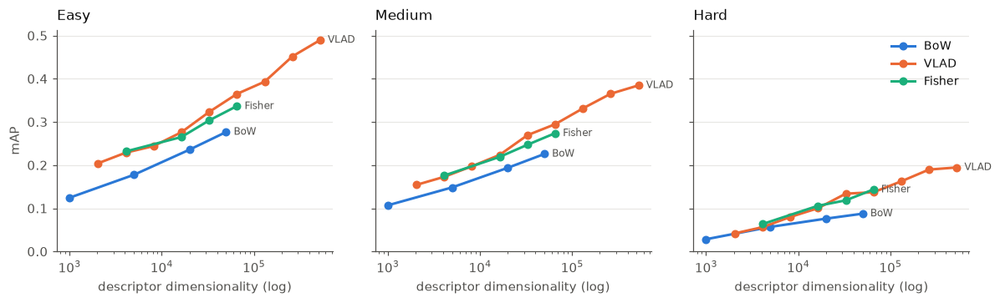

# image-retrieval
Modern image retrieval inspired by 10-year old bachelor's diploma nostalgia

## Setup

```
uv sync
```

## Downloading the benchmark data

```
uv run cbir download --datasets roxford5k rparis6k
# or: uv run cbir download --datasets all
```

Downloads the [ROxford5k and RParis6k](https://huggingface.co/datasets/galilai-group/revisitop)
image retrieval benchmarks into the default Hugging Face cache (`~/.cache/huggingface`),
shared across projects rather than duplicated locally. Each dataset is sanity-checked
against its known image/query counts before use.

Only these two configs are supported — the `revisitop1m` and `oxfordparis` configs in
the upstream loading script are broken and are rejected outright. See
[AGENTS.md](AGENTS.md) for details.

## Evaluating

```
uv run cbir evaluate --dataset roxford5k bow    --k 20000
uv run cbir evaluate --dataset roxford5k vlad   --k 256
uv run cbir evaluate --dataset roxford5k fisher --k 64

# a sweep is one run per k, sharing a single descriptor extraction
uv run cbir evaluate --dataset roxford5k --sweep-k 16 64 256 vlad --seed 0
```

Each run extracts RootSIFT, trains the codebook **on the other dataset**, encodes the
database and the bbx-cropped queries, searches exactly, scores all three protocols, and
appends a row to `results/runs.jsonl`. Read rows back with `cbir results`
(`--current-only` collapses re-runs). RootSIFT extraction and codebooks are cached under
`data/`, so re-running a `k` costs only the encode.

`k` means something different per technique — it is the descriptor dimensionality for
BoW, `k*128` for VLAD and `2*k*128` for Fisher — so compare on dimensionality, not `k`.

## Classic-tier results



Plotted against **descriptor dimensionality**, not `k` — the axis on which the three are
comparable, since equal `k` buys wildly unequal vectors. Regenerated by the last cell of
`notebooks/02_classic_comparison.ipynb`, so it cannot drift from the numbers below.

roxford5k, codebook held out on rparis6k, seed 0, mAP ×100. Medium is the headline
number in the literature; Easy is near-saturated and reported in `results/runs.jsonl`
only.

| method | k | dim | Medium | Hard |
|---|---:|---:|---:|---:|
| BoW | 1000 | 1000 | 10.7 | 2.8 |
| BoW | 5000 | 5000 | 14.8 | 5.7 |
| BoW | 20000 | 20000 | 19.4 | 7.6 |
| BoW | 50000 | 50000 | 22.6 | 8.7 |
| Fisher | 16 | 4096 | 17.6 | 6.3 |
| Fisher | 64 | 16384 | 21.9 | 10.6 |
| Fisher | 128 | 32768 | 24.7 | 11.8 |
| Fisher | 256 | 65536 | 27.4 | 14.4 |
| VLAD | 16 | 2048 | 15.4 | 4.2 |
| VLAD | 32 | 4096 | 17.3 | 5.6 |
| VLAD | 64 | 8192 | 19.7 | 8.0 |
| VLAD | 128 | 16384 | 22.4 | 10.0 |
| VLAD | 256 | 32768 | 26.9 | 13.4 |
| VLAD | 512 | 65536 | 29.5 | 13.7 |
| VLAD | 1024 | 131072 | 33.1 | 16.2 |
| VLAD | 2048 | 262144 | 36.5 | 19.0 |
| **VLAD** | **4096** | **524288** | **38.5** | **19.5** |

**Validation.** Radenović et al. report `HesAff–rSIFT–VLAD` at Medium 33.9 / Hard 13.2 on
this benchmark ([1803.11285](https://arxiv.org/abs/1803.11285), Table 5). VLAD k=1024
here reaches 33.1 / 16.2 — with OpenCV DoG SIFT rather than Hessian-Affine, no
PCA-whitening, and a vocabulary trained on rparis6k rather than a separate landmark set.
Landing on a published number is what licenses trusting the rest of the table; the larger
`k` above it then exceed that reference.

At matched dimensionality the ordering is **VLAD ≥ Fisher > BoW** at every point. Fisher
looks stronger at equal `k` only because its vector is twice as long there.

**VLAD may be levelling off near k=4096, but this is not established.** Its Medium
increments per doubling run +1.9, +2.5, +2.6, +4.6, +2.5, +3.7, +3.4, +1.9 and Hard's run
+1.4, +2.4, +2.0, +3.4, +0.3, +2.5, +2.7, +0.5. The final doubling is the smallest for
both — but Hard already dropped to +0.3 at k=512 and then resumed at +2.5 and +2.7, so a
single small increment has misled here before. Treat k=4096 as the point where returns
stop justifying the cost (twice the storage, 5.2 → 10.5 GB for the database matrix, for
under two points) rather than as a demonstrated ceiling. Confirming a real plateau needs
k=8192, which this setup cannot reach.

BoW and Fisher were not pushed anywhere near their knees; both were still climbing where
they stop above, so their last rows are budget limits, not ceilings.

k=8192 is out of reach here, and RAM is not the reason: `exact_search` moves the database
matrix to the GPU, and 21 GB does not fit in 15.9 GB of VRAM. Going further needs a
chunked search, not a bigger machine.

Caveats: single seed, so small gaps are unresolved; roxford5k only, so the ranking is not
cross-checked on rparis6k; Fisher's GMM is fitted on a seeded 1M-descriptor subsample.

`notebooks/02_classic_comparison.ipynb` plots all of this from `results/runs.jsonl`. Run it
top to bottom — it ships with outputs stripped.

For a browsable dashboard instead, install the optional extra and mirror the record:

```
uv sync --extra tracking
uv run cbir track --current-only     # replay results/runs.jsonl into trackio
trackio show --project cbir
```

trackio is entirely optional — no account, no network, one local SQLite file — and the
store is *derived* from `results/runs.jsonl`, never the reverse. Delete
`~/.cache/huggingface/trackio/cbir.db` and re-run `cbir track` to rebuild it from
scratch at any time.

### Reproducing the table

```
uv run cbir evaluate --dataset roxford5k --sweep-k 1000 5000 20000 50000 bow    --seed 0
uv run cbir evaluate --dataset roxford5k --sweep-k 16 32 64 128 256 512 1024 2048 4096 vlad --seed 0
uv run cbir evaluate --dataset roxford5k --sweep-k 16 64 128 256 fisher --seed 0
```

Roughly 10 hours cold on 16 cores, most of it BoW's k-means at k=20000 and k=50000. VLAD
is 12–31 min per point — below k≈1024 its cost is loading descriptors rather than
clustering, so small `k` is nearly free once the sweep is running.

VLAD at k=4096 needs more than 48 GB of RAM: `encode` holds about three copies of the
10.5 GB database matrix while the ~20 GB of RootSIFT descriptors are still resident. It
was run with WSL at 64 GB. Below k=2048 the default 48 GB is fine.


## CNN-tier results

Frozen ImageNet backbones, plus the published fine-tuned checkpoints in their own
section below. Same protocol as the classic tier:
roxford5k, anything fitted is fitted on rparis6k, seed 0, mAP ×100, queries bbx-cropped,
multi-scale at the three published scales (1, 1/√2, 1/2).

```
uv run cbir evaluate --dataset roxford5k gem  --backbone resnet101 --p 3.0 \
    --scales 1.0 0.7071067811865476 0.5 --dim 2048 --whiten --weights caffe
uv run cbir evaluate --dataset roxford5k rmac --backbone resnet101 --levels 3 \
    --scales 1.0 0.7071067811865476 0.5 --dim 2048 --whiten --weights caffe
```

### Weight provenance is not a detail

"ImageNet-pretrained ResNet101" is not one object. `cnnimageretrieval` builds a
torchvision architecture and fills it with **Caffe-converted** ImageNet weights; we
started with torchvision's. Same architecture, same dataset, same task, different
training recipe — and the descriptors agree at cosine 0.23.

| GeM `p=3` | torchvision | caffe | Δ |
|---|---:|---:|---:|
| **ResNet101** | 34.7 | **46.1** | **+11.4** |
| ResNet50 | 40.8 | 42.5 | +1.7 |
| VGG16 | 42.0 | 40.6 | −1.4 |

It is architecture-specific, not a blanket improvement: torchvision's ResNet101 simply
transfers to retrieval far worse than its ResNet50, and on VGG16 the Caffe weights are
slightly *worse*. MAC is affected most (+16.2 on ResNet101, +8.0 on ResNet50), which
fits the measured difference in the features — Caffe's final conv map is **96% zeros at
std 0.72** against torchvision's **75% at 0.33**, a sparser, higher-contrast
representation where a max picks a real peak rather than diffuse activation.

The 53× difference in conv1 weight scale is *not* the cause: BatchNorm follows conv1 and
its `running_var` ratio (3392) matches that scale squared (2819), so it divides straight
back out. Nor is it channel order — per-filter matching is worse under BGR than RGB. The
two networks simply learned different features.

This cost six wrong hypotheses. Every one assumed the backbone was a fixed input and
looked for the bug downstream; the published table disagreeing with our measurement was
pointing at the input the whole time.

### Validation against the reference table

Radenović et al. ([1803.11285](https://arxiv.org/abs/1803.11285), Table 5), matching
their configuration — their weights, their truncation:

| method | backbone | ours | published | |
|---|---|---:|---:|---|
| GeM `p=3` | VGG16 | 40.5 / 15.5 | 40.5 / 15.7 | exact |
| GeM `p=3` | ResNet101 | 46.1 / 18.6 | 45.0 / 17.7 | above |
| MAC | ResNet101 | 42.7 / 17.2 | 41.7 / 18.0 | above |
| MAC | AlexNet | 27.6 / 9.0 | 28.3 / 8.8 | −0.7 |
| R-MAC | ResNet101 | 46.5 / 14.2 | 49.8 / 18.5 | **−3.2** |

**VGG16 reproduces exactly** once the configuration matches. Our earlier 42.0 was not a
better reproduction — it was a *different* configuration (torchvision weights, trailing
max-pool kept) that happens to score 1.5 higher than the method it was compared against.
Both differences pushed the same way.

**R-MAC is the one row still short, with an identified cause**: the published method
PCA-whitens each *region* vector before summing them, while ours whitens the finished
descriptor. Whitening after the sum cannot undo the correlation the sum compounded.
Closing it needs a projection fitted on region vectors — permitted by the cross-dataset
rule, just not built.

### VGG's trailing max-pool

The reference builds VGG as `features[:-1]`, dropping the final max-pool; we kept it.
That is 4× the positions on the conv map — 64×64 against 32×32 at `max_side=1024`.

| vgg16 GeM `p=3` | pool kept | pool dropped |
|---|---:|---:|
| torchvision weights | 42.0 / 15.6 | 41.6 / **16.7** |
| caffe weights | 40.6 / 15.4 | 40.5 / 15.5 |

Small on Medium, but dropping it is worth **+1.1 Hard** on torchvision weights — more
positions to pool over helps most where the object is small or partly occluded.

### The full grid

All backbones on **torchvision** weights, whitened at native width, so the columns are
comparable to each other. The two ResNet rows that Caffe weights change materially are
noted underneath.

| backbone | dim | SPoC | MAC | GeM `p=3` | R-MAC |
|---|---:|---|---|---|---|
| AlexNet¹ | 256 | 21.0 / 2.5 | 27.6 / 9.0 | 27.9 / 7.2 | 24.4 / 4.1 |
| VGG16 | 512 | 37.2 / 10.9 | 34.9 / 13.7 | **42.0** / 15.6 | 34.4 / 7.3 |
| VGG19 | 512 | 34.7 / 10.0 | 34.6 / 15.1 | 40.0 / **18.4** | 33.6 / 6.5 |
| ResNet18 | 512 | 32.3 / 6.3 | 22.6 / 7.0 | 28.2 / 8.1 | 31.3 / 5.1 |
| ResNet34 | 512 | 32.4 / 5.9 | 24.3 / 6.5 | 29.8 / 6.8 | 33.6 / 6.7 |
| ResNet50 | 2048 | 42.9 / 14.2 | 32.2 / 11.1 | 40.8 / 14.0 | 45.1 / 12.7 |
| ResNet101 | 2048 | 38.1 / 10.2 | 26.5 / 6.7 | 34.7 / 10.8 | 42.8 / 11.1 |
| **ResNet101 (caffe)** | 2048 | 41.9 / 13.6 | 42.7 / 17.2 | 46.1 / **18.6** | **46.5** / 14.2 |
| *(VLAD k=4096, classic)* | *524288* | | | *38.5 / 19.5* | |

¹ AlexNet unwhitened — whitening costs mAP at 256-D.

**Best: ResNet101 R-MAC 46.5 Medium** from 2048 dimensions, against the classic tier's
best of VLAD k=4096 at 38.5 from **524288**. Hard is now close too — 18.6 against VLAD's
19.5, where it used to be a rout.

**Which pooling wins is backbone-dependent.** GeM leads on VGG; the sum-like poolings
lead on the torchvision ResNets. Note the earlier claim that "MAC is worst on every
ResNet" was an artifact of the wrong weights: on Caffe ResNet101 it is second-best and
has the tier's second-best Hard.

**Depth buys little at fixed width.** ResNet18 → ResNet34 gains ~1.7 averaged over
methods; VGG16 → VGG19 loses Medium and gains Hard. The 512 → 2048 width jump is worth
far more, and weight provenance more than either.

### Whitening

Fitted on the held-out benchmark unless a row says otherwise. Gains sort by how much a
method **sums** rather than **maxes** — summing piles up shared components and whitening
decorrelates them, while a max creates no such correlation.

| VGG16, multi-scale | plain | + whitening | gain |
|---|---:|---:|---:|
| SPoC | 27.1 | 37.2 | **+10.2** |
| R-MAC | 28.2 | 34.4 | +6.2 |
| GeM `p=3` | 36.4 | 42.0 | +5.6 |
| MAC | 32.0 | 34.9 | +2.9 |

It reverses on AlexNet, where whitening costs MAC 3.3 mAP (22.9 → 19.6 single-scale) —
at 256-D there is little redundancy to remove and a proportionally noisier tail. Worth
measuring per backbone rather than assuming.

**`--shrinkage ε`** floors whitening's divisor at `sqrt(λ + ε·mean(λ))`. Whitening
divides by `sqrt(λ)`, and when the fitting set is not much larger than the descriptor the
smallest eigenvalues are noise. At 2048 components fitted on 2100 images the pipeline
scores **6.7** unshrunk and **39.3** at ε=0.1. In the regime we actually run (6322
images) it is worth +0.4 to +1.0 on the 2048-D backbones and +0.1 on VGG16 at 512-D.

**`--whiten-source sfm30k|sfm120k`** fits whitening on the retrieval-SfM landmark corpus
the reference uses (a 37.7 GB manual download; see `descriptors/cnn/sfm.py`). Worth +2.3
Medium on *torchvision* ResNet101 — but once the weights are right it stops helping
(46.1 → 45.3), so that gain was whitening compensating for weak features. It saturates
by ~30k images: 30k and 120k differ by 0.2.

### Fine-tuned checkpoints

Everything above is a frozen ImageNet classifier: optimized to tell a golden retriever
from a poodle, and useful for retrieval only because the features happen to transfer.
Radenović et al. also publish the same architectures **fine-tuned for retrieval itself**,
on retrieval-SfM-120k with a contrastive loss over landmark pairs mined by
structure-from-motion. Oxford/Paris overlaps were removed from that corpus, so the
cross-dataset rule holds: nothing was fitted on what it searches.

| backbone | scales | Medium mAP | mP@10 | Hard mAP | mP@10 |
|---|---|---:|---:|---:|---:|
| VGG16 | single | 59.3 | 81.0 | 32.3 | 49.9 |
| VGG16 | multi | 60.7 | 82.3 | 32.9 | 51.0 |
| ResNet101 | single | 63.0 | 83.3 | 38.3 | 54.1 |
| **ResNet101** | **multi** | **65.4** | **86.0** | **40.4** | **56.4** |

Against Table 5, which reports both metrics on both protocols — eight comparisons, not
two, and the paper does not evaluate Easy at all:

| multi-scale | Medium mAP | mP@10 | Hard mAP | mP@10 |
|---|---:|---:|---:|---:|
| VGG16 ours | 60.7 | 82.3 | 32.9 | 51.0 |
| V–[37]–GeM published | 61.9 | 82.7 | 33.7 | 51.0 |
| | −1.2 | −0.4 | −0.8 | **0.0** |
| ResNet101 ours | 65.4 | 86.0 | 40.4 | 56.4 |
| R–[37]–GeM published | 64.7 | 84.7 | 38.5 | 53.0 |
| | **+0.7** | **+1.3** | **+1.9** | **+3.4** |

**This is what the exercise was for.** Every earlier validation point sat at the bottom
of the published range, 40–46, where a two-point discrepancy is hard to read. Reproducing
64.7 confirms the evaluation path at the top of the range as well, so the gaps in the
off-the-shelf grid above are descriptor gaps and not harness gaps.

ResNet101 lands above its published row and VGG16 below its own — opposite directions,
which is not the shape a pipeline error takes. VGG16's Hard mP@10 is exact and its
Medium mP@10 is −0.4, so the top of its ranking matches and the ~1 mAP shortfall is in
the tail. One candidate was tested and rejected: matching the reference's resize order
(normalize first, then bilinearly interpolate the tensor, rather than our single bicubic
PIL resize from the original) moved Medium +0.2 and Hard −0.2. The residual is left
unexplained rather than tuned away.

**The pooling was never the problem.** `p` is differentiable and was therefore trained,
not chosen — and it came out at **2.9208** (VGG16) and **2.9033** (ResNet101) against the
hand-picked 3.0 used everywhere above. Training moved it by 3%. The entire ~19 mAP gap
between the off-the-shelf and fine-tuned rows is in the conv weights.

A checkpoint carries three things, and loading only the first would silently produce a
plausible wrong number: the conv stack, the trained `p`, and a supervised whitening
fitted on matching pairs after training (`meta['Lw']`, in `ss` and `ms` variants for
single- and multi-scale runs). The last of these means these runs fit **nothing** at
extraction time — there is no held-out pass at all, which is why they are also the
fastest rows in the tier.

```
uv run cbir evaluate --dataset roxford5k gem --backbone resnet101 --weights sfm120k \
    --p learned --scales 1.0 0.7071067811865476 0.5 --whiten --whiten-source learned
```

Checkpoints are a manual download (`retrievalSfM120k-vgg16-gem-b4dcdc6.pth`,
`retrievalSfM120k-resnet101-gem-b80fb85.pth`) into `CBIR_WEIGHTS_ROOT`; see
`descriptors/cnn/finetuned.py`. Only GeM was published — there is no fine-tuned R-MAC
checkpoint, and asking for one is refused rather than silently downgraded.

### Where the tiers stand

Same benchmark, same protocol, best row from each:

| tier | descriptor | dim | Medium | Hard |
|---|---|---:|---:|---:|
| classic | VLAD k=4096 | 524288 | 38.5 | 19.5 |
| off-the-shelf CNN | ResNet101 R-MAC, caffe | 2048 | 46.5 | 14.2 |
| off-the-shelf CNN | ResNet101 GeM `p=3`, caffe | 2048 | 46.1 | 18.6 |
| fine-tuned CNN | ResNet101 GeM, multi-scale | 2048 | **65.4** | **40.4** |

The off-the-shelf tier needs two rows because no single one wins both protocols: R-MAC
takes Medium and GeM takes Hard, and R-MAC's Hard is its weakest result — the
per-region-whitening gap documented above. Either way that tier beats the classic one on
Medium from a vector 256× shorter, while **losing** to it on Hard (19.5 against 18.6).

The fine-tuned row wins both outright: +27.0 Medium and +21.0 Hard over VLAD, at 1/256
the width — because the network was trained for the question being asked instead of
borrowed from a classifier.

### Neural Codes

| backbone | dim | Medium | Hard |
|---|---:|---:|---:|
| AlexNet fc6 | 4096 | 12.2 | 2.8 |
| AlexNet fc6 + PCA | 256 | 11.7 | 2.5 |
| VGG16 fc6 | 4096 | 16.3 | 5.1 |
| VGG16 fc6 + PCA | 512 | 15.4 | 5.0 |

Losing to everything else is expected. Babenko et al.
([1404.1777](https://arxiv.org/abs/1404.1777)) report the same ordering for codes off an
ILSVRC-trained network — their contribution is that *retraining* on a landmark set fixes
it, and this harness runs frozen networks only. There is no ROxford reference for the
method, so these rows compare only against our own.

### Other findings

**Multi-scale** is worth +4.7 Medium on AlexNet MAC (22.9 → 27.6). Per-scale descriptors
are L2-normalized before combining, then combined by averaging for every method except
GeM, which reuses its own generalized mean (Radenović et al., §Multi-scale) — worth
~0.2 mAP.

**The `p` curve is flat at its top.** On AlexNet, Medium runs 21.0, 25.8, 27.9, 28.7,
28.5, 26.2 for `p` = 1, 2, 3, 4, 5, 10 — the 3–5 span sits inside 0.8, unresolvable at
one seed. Hard rises monotonically with `p` to true max.

Caveats: single seed throughout, roxford5k only (the rparis6k direction is unrun). Input
is capped at `max_side=1024` and never enlarged, except that
scaled inputs are floored at each backbone's conv-stack minimum (63 px AlexNet, 32 px
elsewhere), which can only trigger below full scale.
